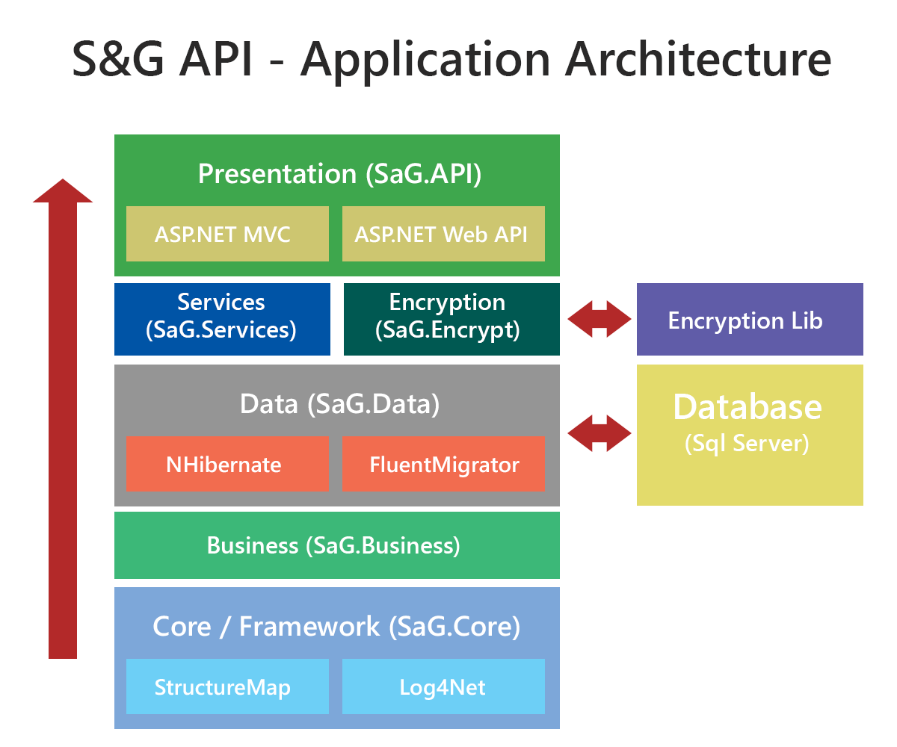

## Multi Tier (NTier)
The application is developed using a multi tier approach.  See below the description of each layers.

## Layers

### Core / Framework (SaG.Core)
Contains infrastructures and components used throughout the application.

* **Structuremap** - library used to handle dependency injection.
* **Log4Net** - library used to handle logging.

### Business (SaG.Business)
Defines the applications business models.

### Data (SaG.Data)
This layer interacts with the database to perform read, write and update operations.

* **FluentNHibernate** - ORM framework used for database transactions
* **FluentMigrator** - library used for database data migrations

### Services (SaG.Services)
Coordinates the application, process commands, performs calculations and makes logical decisions.

* **Encryption** - the encryption library communicates to the **S&G** encryption library (Encrypt.dll).

### Presentation (SaG.API)
The top-most layer of the application.  Communicates to application user to perform tasks.  This layer is built on top of **ASP.NET MVC** and **ASP.NET Web API**.

* **Elmah** - module for web error logging.
* **MiniProfiler** - module for profiling requests and response (Debugging only).
* **Glimpse** - module for debugging requests and response (Debugging only).

[<< Back to Development Guide](README.md)
